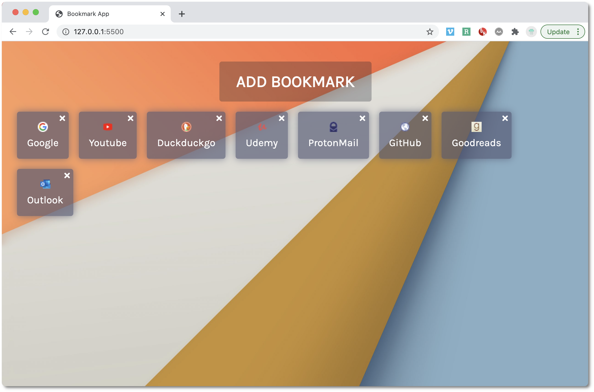

# Bookmark keeper

A bookmark manager built with CSS, HTML & JavaScript and inspired by Safari's new look. 

---

## Features

- You can add new bookmarks by pressing on "add bookmark"
- The bookmark must contain both a name and a valid url
- The favicon is automatically retrieved -> if not, a placeholder appears instead
- You can delete individual bookmarks
- They are saved in localStorage so you can retrieve your bookmarks for future browser sessions

